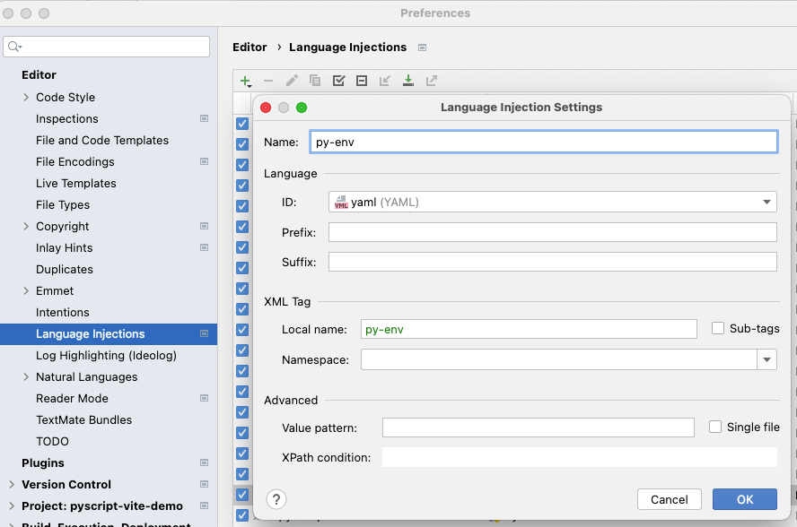
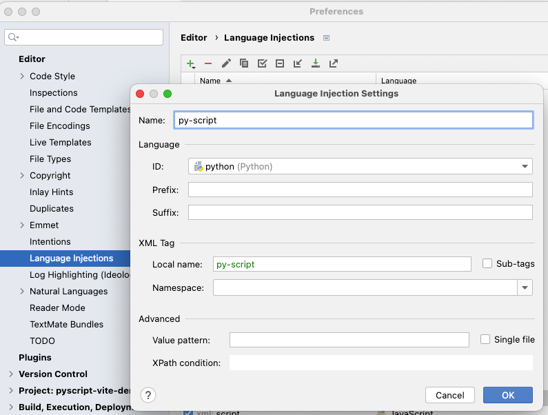

PyScript development with Vite.js
============================

# Requirements

* Python 3.10
* Node.js 16.15.0

# Features

* Language injection by PyCharm
* Auto reload by Vite.js

# PyCharm setup

* Install `Node.js` plugin on PyCharm
* Open PyCharm settings, choose `Edit -> Language Injections` and add injection for `py-env` and `py-script` as
  following:
    - py-env injection

  
    - py-script injection: please add comment after `py-script` tag to prevent code format problem.

  

# Development

* Install dependencies: `npm install`
* Run dev server: `npm run dev`

# why js/pyodide modules?

js/pyodide modules are stub fake modules, and it is used for code completion.

```python
from js import console

console.log('Hello, world!')
```

You can put other global variables in these modules, for example jQuery stub:

```python
from typing import Any, Optional


def jQuery(name: Any, fallback: Optional[callable] = None):
    pass
```

Then you can use `jQuery` function from PyScript code: 

```html
<div id="plot"></div>
<py-script>
from js import jQuery, console

console.log(jQuery("#plot"))

</py-script>
```

* js module: please refer https://developer.mozilla.org/en-US/docs/Web/API/Window 
* pyodide module: please refer: https://github.com/pyodide/pyodide/tree/main/src/py/pyodide

# Tips

* Please put `py-script` tag under body tag and before `</body>`

# References

* PyScript: https://github.com/pyscript/pyscript
* Vite.js: https://vitejs.dev/